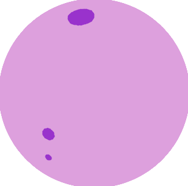

# FruitDataset

## Description

FruitDataset is a repository for creating a dataset of images, each representing a shot from a different point of view of a perfect spherical fruit. The fruit defects are randomly generated and the fruit colors and variety of the defects is fully customizable.

## Installation

Since the project is not a package, the only way to install it is by download or cloning it, via the proper button or the command line (if **git** is installed):

	git clone https://github.com/tommaso1311/FruitDataset
	
## Usage

The usage is pretty straightforward, but let's see some basic commands. Each fruit is firstly created as a Fruit() object, which has several methods:

- *add_defects()*: adds defects of a certain type to the fruit.
- *plot2d()*: plots a projection of the fruit. It is possible to save the defects index for a shot via the *save_defects* parameter.
- *plot_complete_rotation()*: save several images of the fruit which can be used to create a gif via *utils.create_gif()*.
- *save_shots()*: save certain images of the fruit and the defects index. Shots can be generated ad random angles or simulating a roll.

The images can then be post-processed with the Cleaner module:

- *crop()*: removes white pixels from the shot.
- *threshold()*: thresholds the image into certain values (controlled via *thresholds* and *values* parameter).
- *remove_unreliable_pixels()*: remove pixels which are turned white from the previous operations.
- *clean()*: performs all of the above operations on a set of images.